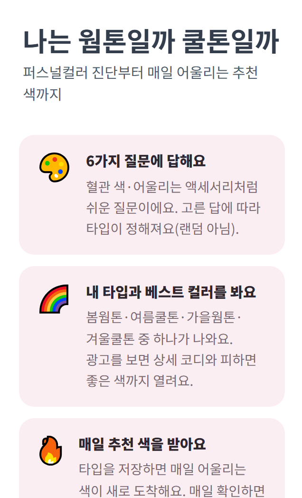
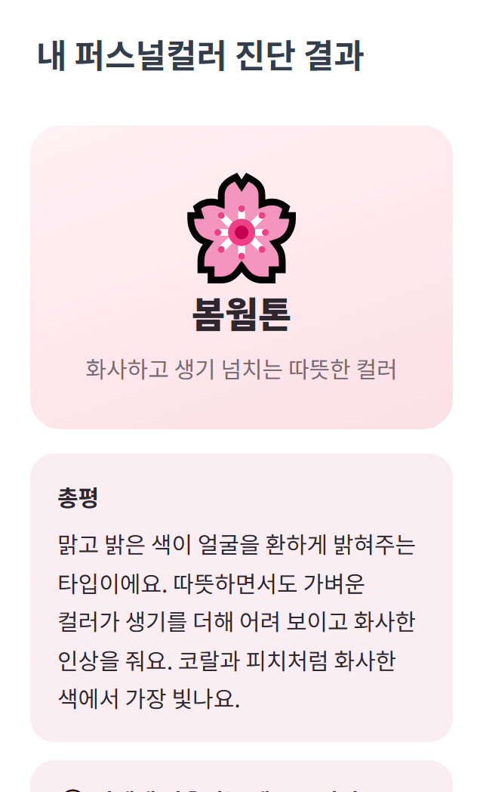
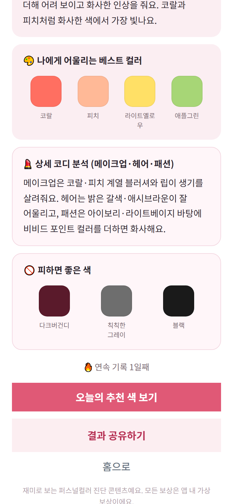
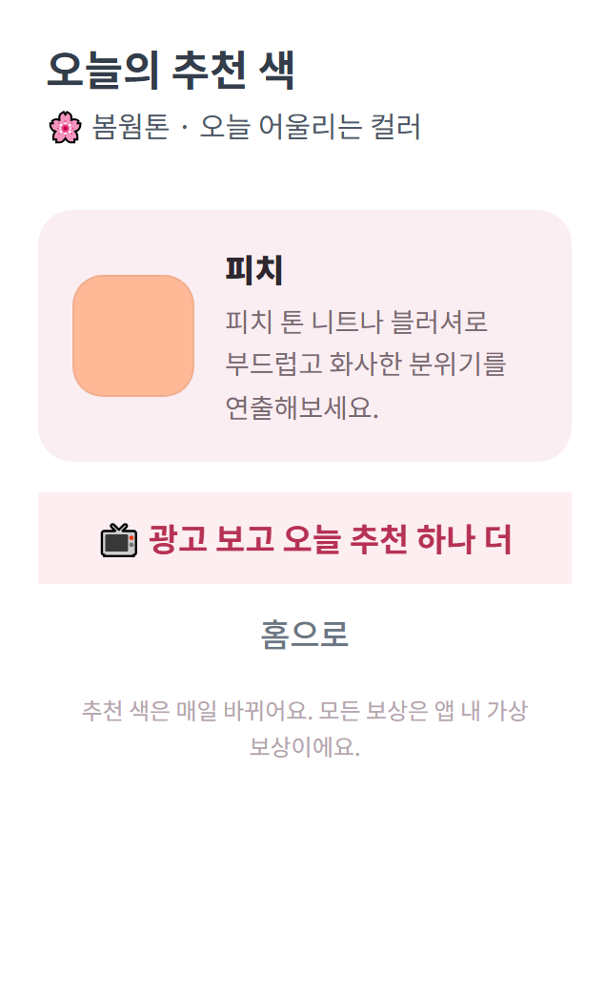

<div align="center">

# 🎨 퍼스널컬러 연구소 (Personal Color Lab)

**몇 가지 질문으로 내 퍼스널컬러 타입을 진단하고, 매일 어울리는 색·코디를 추천받는 토스 미니앱**

[](https://react.dev)
[](https://www.typescriptlang.org)
[](https://vitejs.dev)
[](https://apps-in-toss.toss.im)

토스 앱 속에서 열리는 WebView 미니앱 · 서버 없이 동작하는 클라이언트 전용 진단 도구

</div>

---

## 🎯 한눈에 보기

> 6문항 진단 → 내 컬러 타입 + 베스트 컬러 → (광고로 상세 코디 해금) → 매일 추천 색으로 재방문 → 연속 기록·등급 성장

| | |
|---|---|
| **무엇을** | 선택형 문항으로 퍼스널컬러(봄·여름·가을·겨울 톤)를 진단하고 어울리는/피할 색을 추천 |
| **어디서** | 토스 앱 내 미니앱 |
| **누구를 위해** | 뷰티·패션에 관심 있는 사용자 — 내 컬러를 알고 매일 활용하고 싶은 사람 |
| **누가** | 1인 기획·개발 (프론트엔드 + 진단 로직 설계 + 수익화/리텐션 설계 + 심사 정책) |

비게임 콘텐츠 도구예요. 진단·추천이 코어이고, 연속 기록·등급은 그 위에 얹은 참여 레이어예요. 모든 보상은 앱 내 가상 보상이에요.

---

## 📸 스크린샷

|  소개 화면 | 결과 + 베스트 컬러 | 상세 해금 | 오늘의 추천 |
|:---:|:---:|:---:|:---:|
|  |  |  |  |

---

## ✨ 핵심 기능
- **퍼스널컬러 진단(결정적)** — 6개 문항의 웜/쿨·라이트/딥 축 합산으로 4타입 중 하나에 **결정적으로** 매핑(랜덤 없음).
- **베스트 컬러 팔레트** — 타입별 어울리는 색을 컬러 칩으로 시각화. 상세 코디(메이크업·헤어·패션)와 피할 색은 선택형 보상 광고로 해금.
- **오늘의 추천 색** — 저장한 내 타입 기준, KST 날짜로 회전하는 추천 색·코디 팁(콘텐츠 회전).
- **연속 기록 + 등급** — 매일 확인하면 연속 기록이 쌓이고 누적 참여일로 분석가 등급이 올라가요(가상 보상).
- **광고 게이트(전부 결정적·선택형)** — 상세 해금 / 추천 하나 더 / 연속 기록 지키기. 강제 광고벽·확률형 없음.

---

## 🛠 기술 스택

| 영역 | 사용 기술 |
|---|---|
| **언어** | TypeScript 5 (strict) |
| **프론트엔드** | React 18, Vite 6 |
| **디자인 시스템** | TDS Mobile (토스 디자인 시스템) |
| **플랫폼 SDK** | `@apps-in-toss/web-framework` (Granite 런타임 · WebView 브릿지 · 인앱광고 · 서버 시각 · 공유) |
| **상태/저장** | React 상태 머신 + localStorage (서버·로그인 없음) |
| **수익화** | 인앱 광고(보상형·전면·배너) — 선택형 게이트 기반 |
| **품질** | ESLint(flat config), Prettier, Playwright(E2E 스크린샷) |
| **배포** | `ait build` → `.ait` 아티팩트 → `ait deploy` |

---

## 🧩 클라이언트 상태 머신

서버가 없는 앱이라 모든 상태는 **클라이언트 상태 머신 + localStorage**로 관리돼요.

- `home → quiz → result → today` 네 화면을 URL 없는 스택 라우터로 전환(토스 네이티브 뒤로가기 연동).
- 진단 결과·연속 기록·누적 참여일·오늘 추천 offset을 `useColorState` 한 곳에서 단일 업데이트로 관리(부분 갱신 충돌 방지).
- 일일 리셋·연속 기록 판정은 **토스 서버 시각(`getServerTime`, KST)** 기준 — 기기 시계를 신뢰하지 않아요.

---

## 💡 엔지니어링 하이라이트

<details open>
<summary><b>1. 결정적 진단 — 사행성 리스크 0</b></summary>

> 결과를 랜덤으로 뽑지 않고, 문항 답의 웜/쿨·라이트/딥 가중치 합산으로 4타입에 **결정적으로** 매핑했어요. 같은 답이면 항상 같은 결과 — 확률형 뽑기/리롤이 없어 심사 사행성 리스크를 원천 차단했어요.
</details>

<details>
<summary><b>2. 자발적 광고 시청 루프 (강제 광고벽 없음)</b></summary>

> 광고는 "상세 코디 해금 / 추천 하나 더 / 연속 기록 지키기"처럼 **사용자가 원하는 것** 뒤에만 선택형으로 배치했어요. 광고 보상은 전부 결정적(+1·해금·지키기)이라 정책상 안전하고, 강제 노출이 없어 이탈을 줄였어요.
</details>

<details>
<summary><b>3. 그레이스풀 디그레이데이션</b></summary>

> 광고 그룹 ID가 비어 있어도 `isSupported` 가드 + 빈 키 즉시 통과로 브라우저 '둘러보기'에서 흐름이 끊기지 않아요. 덕분에 로컬에서 Playwright로 전체 플로우를 캡처·회귀 검증할 수 있어요.
</details>

<details>
<summary><b>4. 일일 리셋·연속 기록의 시간 정합성</b></summary>

> "오늘의 추천 색"과 연속 기록은 서버 시각(KST) 기준으로 판정해요. 클라 시계 조작에 흔들리지 않고, 날짜 해시로 추천을 결정적으로 회전시켜 매일 다른 색을 안정적으로 보여줘요.
</details>

---

## 🚀 로컬 실행

```bash
npm install
cp .env.example .env   # 값은 비워둬도 '둘러보기'로 흐름 확인 가능
npm run dev
```
```bash
npm run build   # vite/ait 빌드 → .ait 아티팩트
npm run deploy  # 앱인토스 콘솔로 배포
```

스크린샷 회귀:
```bash
npx playwright install chromium
node scripts/screenshots.mjs   # dev 서버 실행 중 → screenshots/ 캡처
```

---

## 📂 프로젝트 구조

```
src/
├─ lib/         env · analytics · tossEnv · dateKey(KST 서버시각)
├─ hooks/       useAdGate · useInterstitialAd · useColorState(진단·연속·등급)
├─ components/  BannerAd
├─ data/        color(타입·문항·팔레트·추천) · share · notify
├─ screens/     Home · Quiz · Result · Today
└─ App.tsx      스택 라우터 + 광고 게이트 조립
scripts/        Playwright 스크린샷
```

---

## 🗺 로드맵
- [ ] 광고 그룹 ID 연결 → 수익화 활성화
- [ ] 데일리 리마인드 푸시(스마트 발송) 연동
- [ ] 지표 안정화 후 토스포인트 보상 도입(서버 중복지급 방지)

---

<div align="center">

**개인 포트폴리오 목적으로 공개한 저장소예요.**
앱인토스 미니앱 · 비게임 진단 도구 · 수익화/리텐션/심사 정책까지 1인 개발한 사례로 봐주세요. 🎨

</div>
